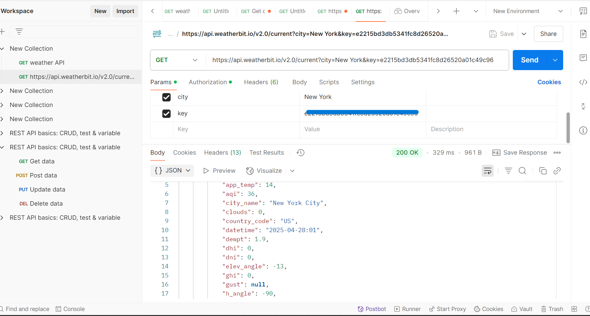

# API-Weather

 API Exploration

## Project Overview

This project focuses on interacting with the Weatherbit API using Postman. The goal is to understand API request setup, analyze JSON responses, and document findings for future reference.

---

## Objectives

1. Gain hands-on experience with the Weatherbit API.
2. Set up and send GET requests via Postman.
3. Analyze and document API responses.
4. Reflect on the significance of query parameters in API interactions.

---

## Steps to Execute

### Part 1: Sending a Request to the Weatherbit API

1. **Register and Get API Key**:
   - Sign up at [Weatherbit.io](https://www.weatherbit.io/).
   - Retrieve your personal API key.
2. **Set Up the Request in Postman**:
   - Use the endpoint: `https://api.weatherbit.io/v2.0/current`.
   - Add query parameters:
     - `city`: Specify the location (e.g., `New York`).
     - `key`: Enter your API key.

### Part 2: Analyzing and Documenting the Response

1. **Analyze JSON Response**:

   - Check for key data such as temperature, weather description, and location.
   - Example fields:
     - `temp`: Current temperature.
     - `weather.description`: Brief weather condition.
     - `city_name`: Location queried.

2. **Status Codes**:
   - `200 OK`: Request was successful.
   - `401 Unauthorized`: API key is missing or incorrect.
   - `404 Not Found`: Endpoint or query parameters are invalid.

---

## Findings

### Request URL

`https://api.weatherbit.io/v2.0/current?city=New York&key=MY_API_KEY`

### Query Parameters Used

- `city`: NEW-YORK CITY
- `key`: MY_API_KEY

### JSON Response Summary

- Temperature: 14
- Weather: Clear sky
- Location: NEW-YORK, US

---

## Screenshots

Include screenshots of:

1. Postman setup showing the request URL and query parameters.

2. JSON response received.

## Reflection

### Importance of Query Parameters

- Correct query parameters are essential for precise responses.
- Missing or inaccurate parameters can lead to incomplete data or errors.

### Challenges Faced

- Debugging issues with API key or parameter format.
- Understanding nested JSON objects.
